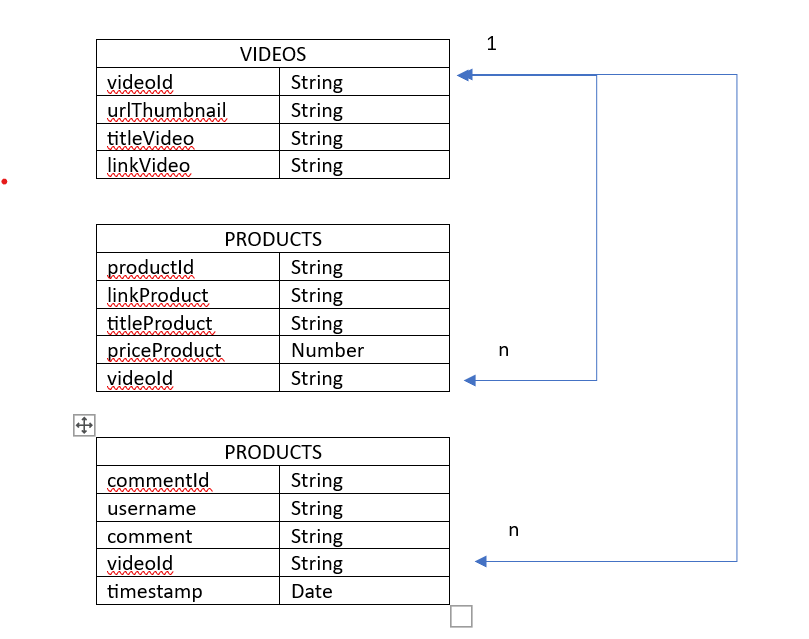
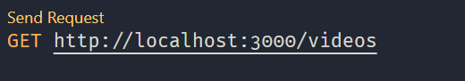

# MID TERM GENERASI GIGIH 3.0

**MUH SURYADI TRIPUTRA RAHMAN** (GG3FSGP0401) <br>
*FULL STACK ENGINEER 6 CLASS*

## DATABASE STRUCTURE



## FOLDER STRUCTURE

* .vscode contains recommendations for vscode extensions used in this project
* [collections](./collections/) contains sample collections mongoDB
* [config](./config/) contains configuration mongoDB
* [controllers](./controllers/) contains handler 
* [images](./images/) contains images used in readme.md
* [models](./models/) contains schema mongoose
* [repository](./repository/) contains query moongose 
* [rest](./rest/) contains sample response
* [routes](./routes/) contains route in this project
* [services](./services/) contains business logic
* .env contains environment variable
* .eslintrc.json contains config eslint
* .prettierrc contains config prettier
* app.js is main app

## API STRUCTURE

* /api/v1/videos 
* /api/vi/video/{videoId}/products
* /api/vi/video/{videoId}/comments

## REQUEST & RESPONSE

### GET /api/v1/videos

Return all videos 

* Code : 200
* Content:

```


```

### POST /videos 

Create a new video and returns the id

* Code : 201
* Headers: 
```
  Content-Type: application/json
```
* Payload :

```
{
  "urlThumbnail": String,
  "titleVideo": String,
  "linkVideo": String
}

```

### GET /products

Return all products with videoId

* Code : 200
* Headers: 
```
  Content-Type: application/json
```
* Payload :
```
{
  "videoId" : String
}
```
* Content:

```
[
  {
    "_id": String,
    "productId": String,
    "linkProduct": String,
    "titleProduct": String,
    "priceProduct": Number,
    "videoId" : String,
    "__v": Number
  }
]

```

### POST /products 

Create a new product and returns the id

* Code : 201
* Headers: 
```
  Content-Type: application/json
```
* Payload :

```
{
  "linkProduct": String,
  "titleProduct": String,
  "priceProduct": Number,
  "videoId" : String,
}

```

### GET /comments

Return all comments with videoId 

* Code : 200
* Headers: 
```
  Content-Type: application/json
```
* Payload :
```
{
  "videoId" : String
}
```
* Content:

```
[
  {
    "_id": String,
    "commentId": String,
    "username": String,
    "comment": String,
    "videoId" : String,
    "timestamp" : Date,
    "__v": Number
  }
]

```

### POST /comments 

Create a new comment and returns the id

* Code : 201
* Headers: 
```
  Content-Type: application/json
```
* Payload :

```
{
  "username": String,
  "comment": String,
  "videoId" : String,
}

```

## HOW TO RUN

### Requirements

* [Nodejs](https://nodejs.org/en) (v18.17 or newer)
* [Visual Studio Code](https://code.visualstudio.com/)
* [MongoDb](http://www.mongodb.com/) (v6.0.8 or newer)

### RUN
1. Install all depedencies
```
npm i
```
1. Install Recommendation Extension for VS Code (REST CLIENT) <br> 
   REST CLIENT is vscode extension to send request easyly

2. Create new db tokopedia-play on mongoshell (Terminal)
```
use tokopedia-play
```   

1. Import sample collections on folder [collections](./collections/) to tokopedia-play db
   
2. rename .env.example  to .env and fill the variables with your own

3. Run the Server
```
npm start
```

4. Open file on folder [rest](./rest/) and start send request
   


5. Happy Coding